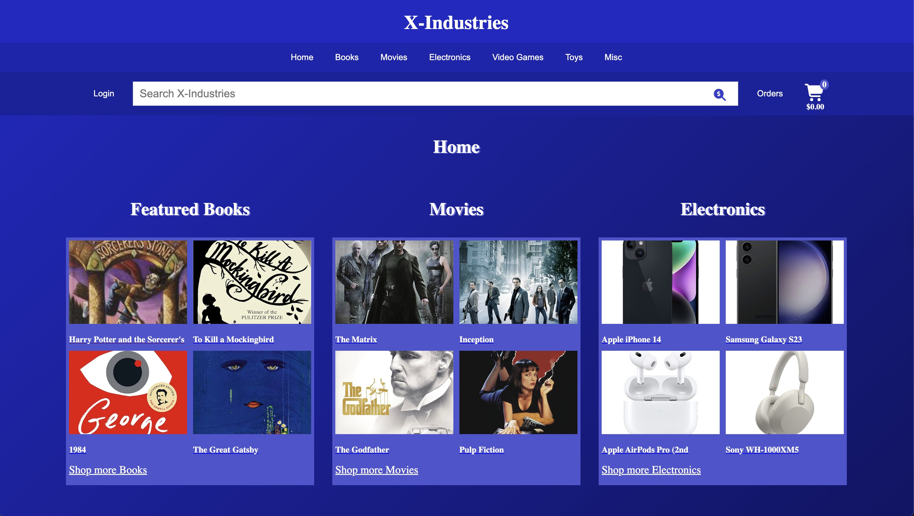
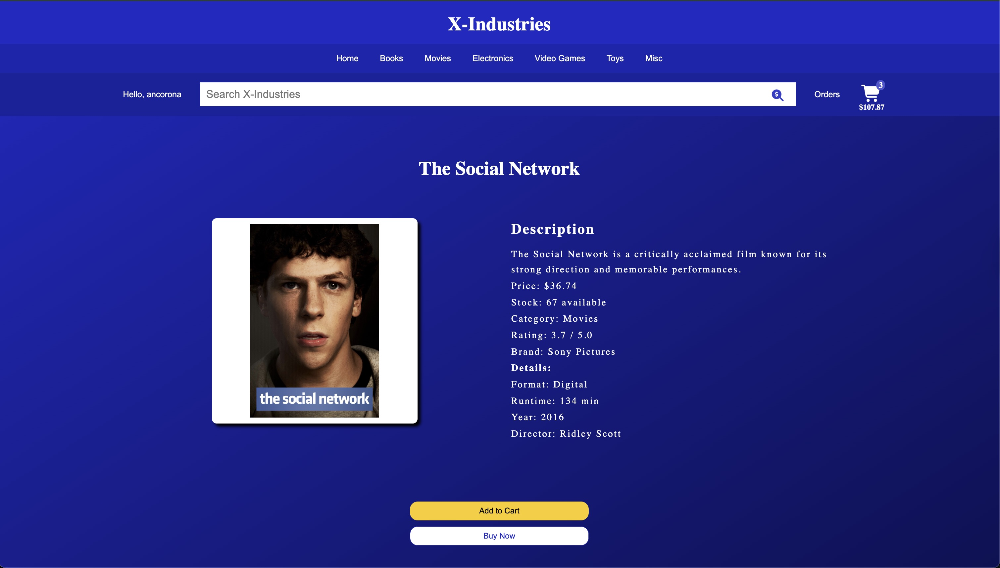
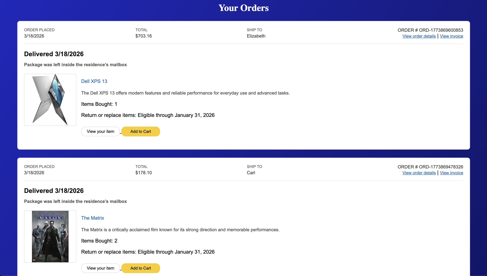
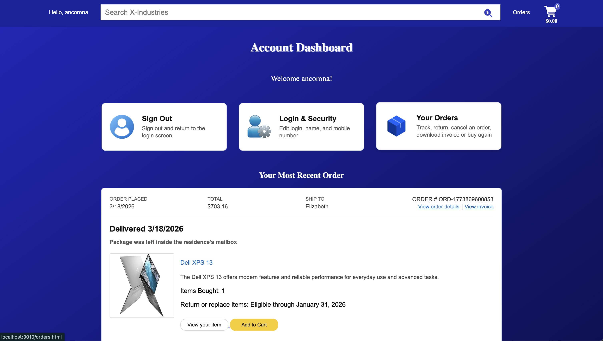

# 🛒 X-Industries

A full-stack e-commerce web application inspired by Amazon, designed to demonstrate real-world software engineering concepts including authentication, REST APIs, database integration, and dynamic UI rendering.

Users can browse products, search by category, manage a shopping cart, create accounts, and place orders with persistent storage using MongoDB.

---

## 🚀 Live Demo

*(Coming soon — deployment in progress)*

---

## 📸 Screenshots

### Home Page


### Product Page


### Orders Page


### Dashboard Page


---

## ✨ Features

- 🛍️ Product browsing by category
- 🔍 Search functionality
- 🛒 Shopping cart system with quantity controls
- ⚡ Buy Now checkout flow
- 👤 User authentication (register/login/logout)
- 📦 Order history tracking
- 📊 User dashboard with recent orders
- 🔁 “Buy Again” functionality from previous orders
- 🧠 Centralized configuration system (no hardcoded URLs)
- ☁️ MongoDB Atlas database integration

---

## 🧾 Order System

Users can:

- Place orders from the cart or buy-now flow
- View full order history
- View most recent order on dashboard
- Re-add previous items using "Buy it again"

All orders are stored in MongoDB and fetched via authenticated API requests.

---

## 🔐 Authentication

- Secure user registration and login
- JWT-based authentication
- Token stored in localStorage
- Protected routes (orders, dashboard, profile)

---

## 🛠️ Technologies Used

### Frontend
- HTML5
- CSS3
- Vanilla JavaScript (ES Modules)

### Backend
- Node.js
- Express.js

### Database
- MongoDB Atlas
- Mongoose

### Other
- REST APIs
- LocalStorage (cart persistence)
- SessionStorage (checkout flow)

---

## 📁 Project Structure

```
x-industries/
├── public/
│ ├── *.html # Application pages
│ ├── js/
│ │ ├── config.js # Centralized configuration
│ │ ├── app.js
│ │ ├── cart.js
│ │ ├── auth.js
│ │ ├── orders.js
│ │ └── ...other scripts
│ ├── styles.css
│ ├── images/
│ └── data/ # Product JSON data
│
├── server/
│ ├── server.js # Express server
│ ├── scripts/
│ │ └── importData.js # Seed script
│ └── ...routes/models
│
├── package.json
├── .env
└── README.md
```

---

## ⚙️ Running the Project Locally

### 1. Clone the repository

```bash
git clone https://github.com/your-username/x-industries.git
cd x-industries
```

2. Install dependencies:
```bash
npm install
```

3. Configure environment variables
Create a .env file:
```env
MONGODB_URI=your_mongodb_connection_string
JWT_SECRET=your_secret_key
PORT=3010
```

4. Seed the database
```bash
npm run import:data
```

5. Seed the database
```bash
npm start
```

6. Open the app
```
http://localhost:3010
```

---

## 💻 Development

To modify or extend the project:

1. Run the server locally
2. Edit frontend JS/HTML/CSS files
3. Update backend routes or models as needed
4. Refresh browser to test changes

---

## 🧠 Key Improvements (Post-Migration)

- Migrated from CodeSandbox → GitHub
- Refactored project structure
- Implemented MongoDB Atlas integration
- Built full authentication system
- Created order history + dashboard system
- Centralized all API routes using config.js
- Converted frontend scripts to ES modules
- Fixed multiple data flow and state management bugs

---

## 🤝 Contributing

Contributions are welcome.

If you'd like to improve the project:

1. Fork the repository
2. Create a feature branch
3. Commit your changes
4. Open a pull request

---

## 📌 Versioning

v1.0.0 — First stable full-stack release with authentication, MongoDB integration, and order system

---

## 📄 License

This project is open source and available under the **MIT License**.

---

## 👤 Author

Developed by: Antonio Corona Montes De Oca  
GitHub: https://github.com/antonioc-26
